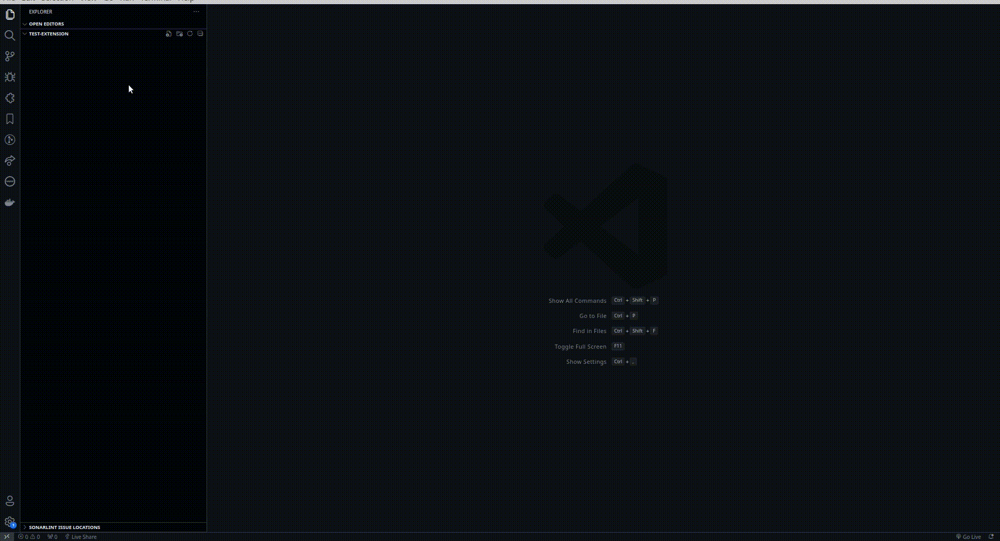

<p align="center">
  <br />
  <a title="bayon" href="https://github.com/DevJoaoLopes/Bayon-Component-Generator"></a>
</p>


# Component Generator

Helps in creating your React component, generating files and boilerplates for its development.

# How to use

* Install the extension.
* In your explorer, right-click and select **Bayon Generate Component**
* Enter the name of the component to be created in the input.



## Files

#### Component React

```typescript

import React from 'react';
import * as Styles from './NameComponent.styles'

export const NameComponent = () => {
    return (
        <Styles.Container>
          <div></div>
        </Styles.Container>
    );
};

```


#### Component Styled

```typescript

import { styled } from '@bayon/commons';

export const Container = styled('div')(() => ({
  display: 'flex',
  boxSizing: 'border-box',
}));

```


#### Index exported

```typescript

export { NameComponent } from './NameComponent';
```


#### Component Test with Jest

```typescript

import React from 'react';
import { render, screen } from '@bayon/testing';

import { NameComponent } from './NameComponent';

describe('<NameComponent />', () => {
  it('should render component', () => {
    createComponent();
    expect(screen.getByText('')).toBeInTheDocument();
  });
});

const createComponent = (props = {}) => {
  const defaultProps = {
    ...props,
  };

  return render(<NameComponent {...defaultProps} />);
};

```

# License

[GPL-3.0](LICENSE.md) &copy; Joao Victor Faustino Piga Lopes